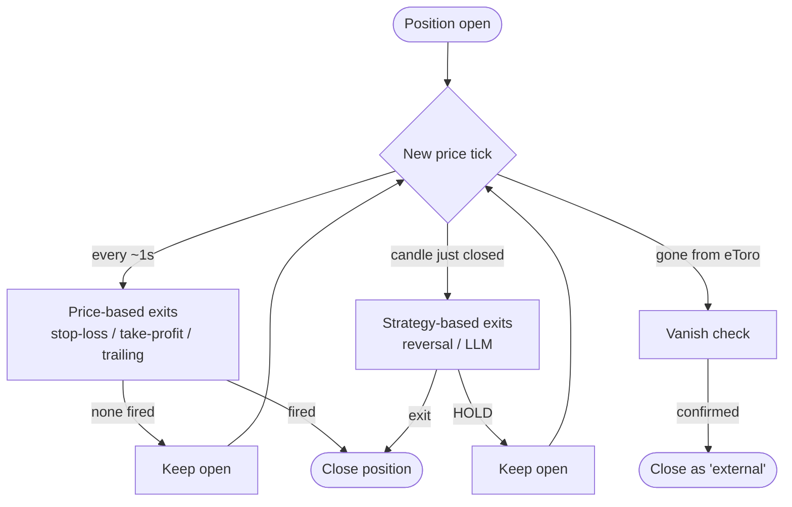
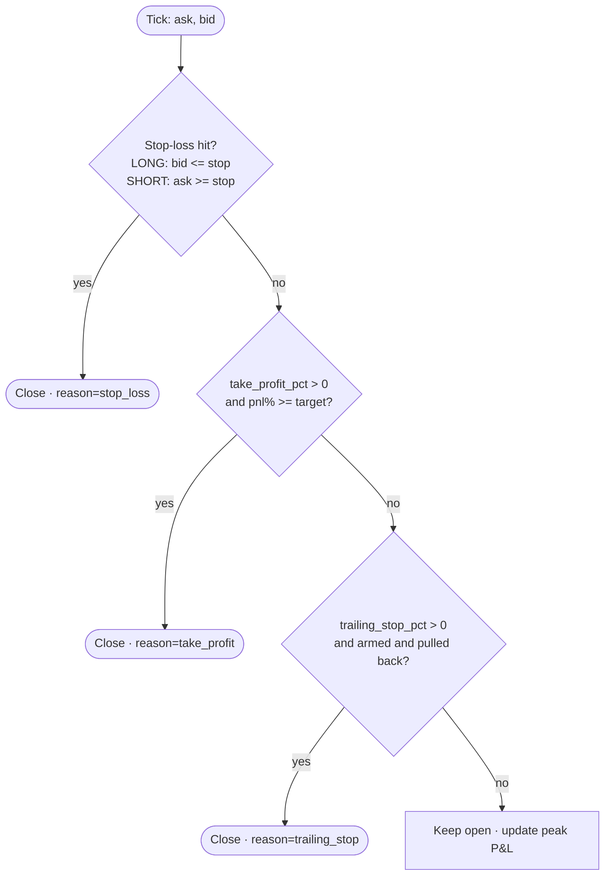
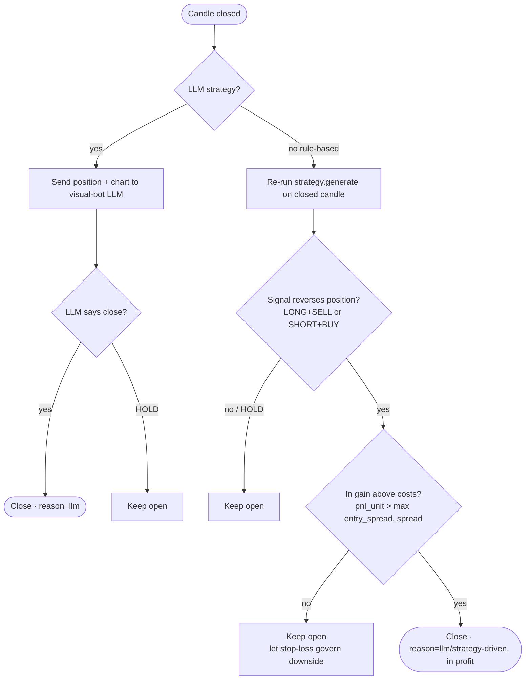
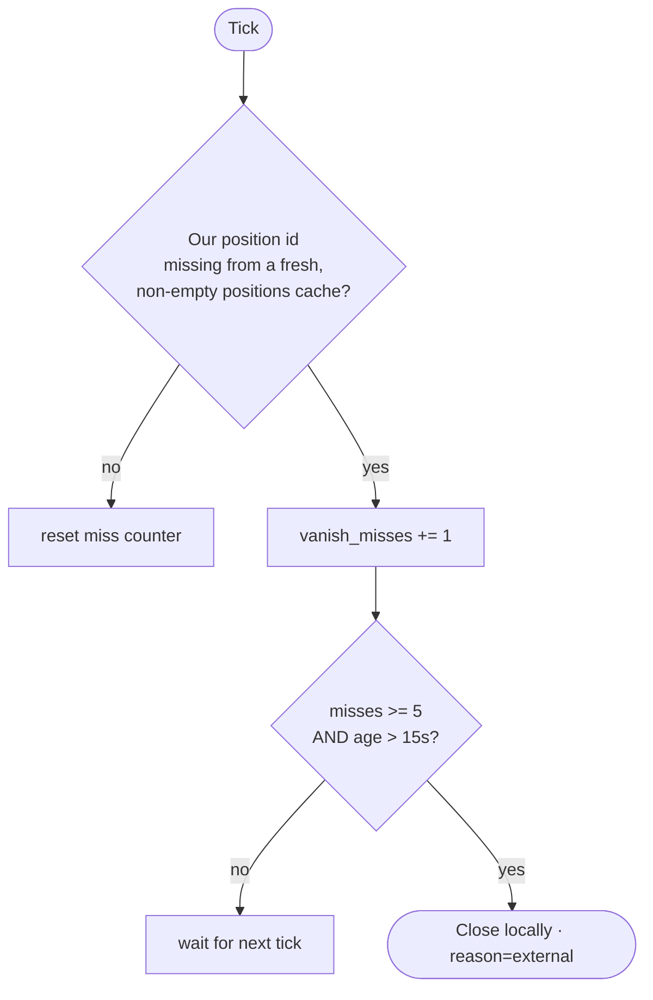

# How a Position Is Closed — Exit Logic Playbook

> Source of truth: `trading_engine._instrument_loop` (the per-tick loop),
> `trading_engine._strategy_exit_check`, and the `check_*` helpers in
> `trade_manager.py`. This doc mirrors the **current** code so we can analyse it
> together and tune for profitability.

---

## 1. The five ways a position closes

Every open position is watched on two clocks:

- **Every price tick (~1s)** → price-based safety exits (stop-loss, take-profit, trailing).
- **Every *completed* candle** → strategy-driven exits (rule reversal or LLM decision).

| # | Exit | Clock | Applies to | Trigger |
|---|------|-------|------------|---------|
| 1 | **Hard stop-loss** | tick | all bots | price hits the protective stop set at entry |
| 2 | **Take-profit** | tick | if `take_profit_pct > 0` | profit reaches +X% of entry |
| 3 | **Trailing stop** | tick | if `trailing_stop_pct > 0` | price pulls back X% from peak (only once in profit) |
| 4 | **Strategy reversal** | candle close | rule-based bots | strategy flips direction **and** position is in profit above costs |
| 5 | **LLM exit** | candle close | LLM bot only | the model decides to close |
| — | *External / vanish* | tick | all bots | position disappeared from eToro (its SL/TP, app, or a merge) |

---

## 2. Lifecycle overview



---

## 3. Per-tick price exits (priority order)

These are an **`elif` chain** — at most **one** fires per tick, highest priority first.



**Stop-loss price** (fixed at entry, `compute_stop_loss_price`):

```
dist = max(2.0 × entry_spread,  entry_price × 2.5%)
LONG  stop = entry_price − dist
SHORT stop = entry_price + dist
```

**Trailing stop** (`check_trailing_stop` + `trailing_stop_trigger_price`):
- Only **arms once `peak_pnl > 0`** (position has been in real profit).
- Peak price is reconstructed from the recorded peak P&L; trigger =
  `peak_price × (1 − trail%/100)` for LONG (mirror for SHORT).
- `peak_pnl` is refreshed every tick by `update_peak_pnl`.

---

## 4. Per-candle strategy exits

Runs only when a candle **closes** (uses committed candles, so decisions are on
the *just-completed* candle, never the forming one).



**Profit gate (added per your request).** A rule-based reversal now closes **only
when the trade is profitable above friction**:

```
pnl_unit = unrealised_pnl(trade, ask, bid)      # realisable profit / unit, net of exit spread
cushion  = max(entry_spread, current_spread, 0)
close only if  pnl_unit > cushion               # otherwise HOLD
```

So a strategy flip **never dumps a losing position** — the hard stop-loss is the
only thing that realises a loss.

---

## 5. External / vanish detection



This catches positions eToro closed on its side (its own SL/TP, the eToro app,
or a **position merge** when several same-symbol trades get clubbed together).
Debounced hard (5 confirmed misses + 15s grace) so a transient API hiccup can
never falsely strip a live position.

---

## 6. Current parameters

| Parameter | Value | Where | Notes |
|-----------|-------|-------|-------|
| `STOP_LOSS_MULT` | `2.0` | trade_manager | stop = 2× spread … |
| stop-loss floor % | **per-strategy** | `exit_profiles.py` | …or the profile's % of entry, whichever is wider |
| trailing / take-profit | **per-strategy** | `exit_profiles.py` | see profile table below |
| reversal profit cushion | `max(entry_spread, spread)` | _strategy_exit_check | reversal only closes in profit |
| `VANISH_MISS_THRESHOLD` | `5 ticks` | trading_engine | confirmed misses before external close |
| `VANISH_GRACE_SEC` | `15s` | trading_engine | min age before a vanish can close |

### Per-strategy exit profiles (`exit_profiles.py`)

Exits now follow the **strategy's behaviour class** instead of one global setting.
Applied at bot start and re-applied when a bot's strategy is changed. A bot can
still override via `trailing_stop_pct` / `take_profit_pct` in `instruments.toml`.

| Class | Strategies | Trailing | Take-profit | Stop-loss | Payoff |
|-------|-----------|---------:|------------:|----------:|--------|
| **trend** | supertrend, ma_crossover, macd, adx, ichimoku, donchian, orb | 2.0% | — | 2.5% | ride winners, room to breathe |
| **mean_revert** | rsi, stoch_rsi, bollinger_squeeze, mean_reversion, candlestick | 1.0% | 1.2% | 1.0% | ≈1.2 : 1 — breakeven ≈ 45% win |
| **arb** | stat_arb, rate_arb | — | 0.6% | 0.5% | ≈1.2 : 1 — breakeven ≈ 45% win |
| **llm** | llm | 2.0% | — | 2.5% | model exits per candle |

Why the stops were tightened (journal evidence, 238 bot trades):

- mean_revert: 38% win, avg win **+0.33%** vs avg loss **−0.46%**, with the worst
  10% of losses at **−2.0%** — losers were riding the old uniform 2.5% stop while
  wins were small. Risking 2.5% to make 1.2% needed a 68% win rate; the 1.0%
  stop needs only ~45%.
- arb: harvests ~0.6% edges — risking 2.5% for 0.6% was a 4:1 *inverse* payoff.
- trend (58% win) and llm keep the wide stop: trend trades need room and the
  trailing stop banks the upside.

The stop is also sent to eToro server-side at open (`stop_loss_rate`), so it is
enforced even if our process is down. New journal records now include
**`peak_pnl`** and **`stop_loss_price`**, so the next tuning round can backtest
"would a tighter TP/trailing have banked this trade?" from data.

### Asset-class volatility scaling

The profile %s above are calibrated on **crypto** (our XRP/BTC journal). Other
asset classes scale all three exit parameters by typical relative volatility
(research consensus: stock stops run ~1.5–2.5× ATR vs crypto's 2–5× ATR):

| Class | Scale | Example: mean_revert stop |
|-------|------:|---------------------------|
| crypto (XRP, BTC, …) | ×1.0 | 1.0% |
| commodity (gold, oil, …) | ×0.7 | 0.7% |
| stock (everything else) | ×0.5 | 0.5% |

Classification is **authoritative from the eToro API**: at bot start the engine
reads the instrument's `instrumentTypeID` (1 Forex · 2 Commodity · 4 Indices ·
5 Stocks · 6 ETF · 10 Crypto) and registers it in `exit_profiles`. Label-keyword
matching remains only as a fallback. Extra classes: etf ×0.5, index ×0.4,
forex ×0.3. The class is also sent to the LLM so its prompt context matches.
Adding any new bot to `instruments.toml` automatically gets correctly-sized
exits for its real asset type.

### LLM prompt discipline (visual-bot)

The LLM entry/exit prompt was rebuilt around journal evidence (44 LLM trades:
long-bias −$166 on longs vs +$53 on shorts; worst losses were adopted losers
held for hours):

- entries REQUIRE a stated **target**, **invalidation level**, and **R:R ≥ 2:1**;
- bull case AND bear case must both be argued before picking a side (kills the
  long bias);
- "don't chase" + calibrated-confidence rules (entry confidence < 70 ⇒ no trade);
- losing positions beyond spread-recovery need an ACTIVE chart reason to hold,
  otherwise close — no more holding losers on hope;
- asset-class context injected per instrument (crypto/stock/commodity);
- mechanical safety net in the parser: stated R:R < 1.5 or confidence < 70
  vetoes the entry even if the model still says BUY/SELL.

---

## 7. Profit math we should reason about

For a **LONG** (mirror for SHORT):

```
You enter at the ASK, exit at the BID.
Round-trip spread cost ≈ entry_spread + exit_spread  (both already in the P&L math)

Net realised (per unit) = bid_exit − ask_entry
Dollar P&L              = (exit_price − entry_price) × units,   units = trade_amount / entry_price
```

Key tensions to analyse:

1. **Stop distance (2.5% min) vs. trailing (1.5%)** — the stop is *wider* than the
   trailing trigger. Once a trade arms the trailing stop, it can exit on a 1.5%
   pullback; but a trade that never gets into profit rides all the way to −2.5%.
   Is the asymmetry right?
2. **Take-profit is now per-strategy** (see §6): trend bots trail, mean-revert &
   arb bots use a hard TP. Next we should tune the exact %s against the journal.
3. **Reversal profit gate.** We now hold losers until the stop-loss. Good for
   avoiding "sell the dip", but it can convert a small reversal loss into a full
   −2.5% stop. Worth measuring.
4. **Candle timeframe.** Exits only re-evaluate on candle close. On 15-min bots a
   reversal can be ~15 min late. Trade-off vs. noise.
5. **External closes dominate.** Most historical closes were eToro-side
   (merges/SL-TP). If the bots don't control the exit, none of the above logic
   matters. **This is probably the #1 lever.**

---

## 8. Open questions for our session

- [ ] Should we set **explicit per-order SL/TP on eToro** so the bot's intended
      exit is enforced even if our process is mid-cycle — or does that fight the
      trailing logic?
- [ ] Should each instrument run **one position at a time** (fewer bots/instrument)
      to stop eToro from merging same-symbol trades and destroying bot identity?
- [ ] Per-strategy exit tuning: trend strategies (Supertrend/MA) want to **ride**
      winners (trailing), mean-reverting strategies (RSI/Bollinger) want a **hard
      TP**. Should exit config be per-strategy, not global?
- [ ] Is the **2.5% stop** appropriate for both BTC and XRP, or should it be
      ATR-scaled per instrument?
- [ ] Measure: of bot closes, what % are stop_loss vs trailing vs llm vs external,
      and what's the average P&L of each? (We have this in the journal.)
```

